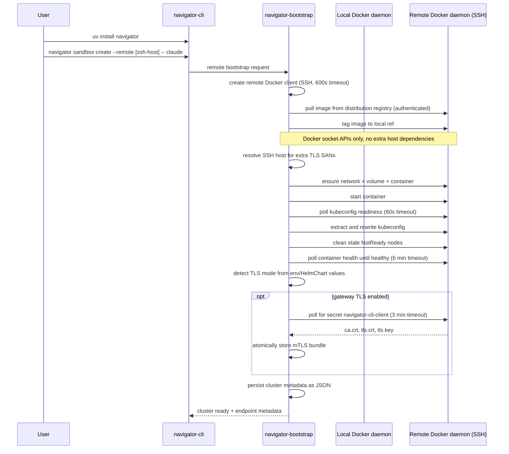
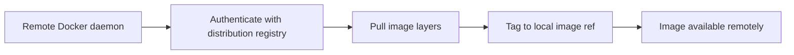

# Cluster Bootstrap Architecture

This document describes how Navigator bootstraps a single-node k3s cluster using Docker, for both local and remote (SSH) targets.

## Goals and Scope

- Provide a single bootstrap flow through `navigator-bootstrap` for local and remote cluster lifecycle.
- Keep Docker as the only runtime dependency for provisioning and lifecycle operations.
- Package the Navigator cluster as one container image, transferred to the target host via registry pull.
- Support idempotent `deploy` behavior (safe to re-run).
- Persist cluster access artifacts (kubeconfig, metadata, optional CLI mTLS certs) in the local XDG config directory.

Out of scope:

- Multi-node orchestration.

## Components

- `crates/navigator-cli`: user-facing commands (`deploy`, `stop`, `destroy`, `tunnel`).
- `crates/navigator-bootstrap/src/lib.rs`: cluster lifecycle orchestration.
- `crates/navigator-bootstrap/src/image.rs`: remote image registry pull.
- Docker daemon(s):
  - Local daemon for local deploys.
  - Remote daemon over SSH for remote deploy container operations.

## Onboarding Flow (Remote)

Target operator flow for remote onboarding is two commands:

```bash
uv install navigator
navigator sandbox create --remote [ssh-host] -- claude
```

- `uv install navigator` installs the CLI (Artifactory distribution is planned).
- `navigator sandbox create --remote ...` triggers remote bootstrap and then launches the sandbox workflow.

## Diagram Guide

- **Bootstrap sequence**: onboarding entrypoint plus image transfer, docker-socket-only provisioning, health checks, and TLS handling.
- **End-state connectivity**: steady-state connectivity for endpoints, SSH, and control-plane-audited access.

## Bootstrap Sequence Diagram



## End-State Connectivity Diagram

```mermaid
flowchart LR
  subgraph WS[User workstation]
    NAV[navigator-cli]
    KUBECTL[kubectl]
    KC[stored kubeconfig\n~/.config/navigator/clusters/(name)/kubeconfig]
    MTLS[mTLS bundle optional\nca.crt, tls.crt, tls.key]
    TUN[ssh -L 6443:127.0.0.1:6443 user@host]
  end

  subgraph CP[Navigator control plane]
    API[HTTPS API with mTLS]
    AUDIT[Audited session and access logs]
    CONNECT[HTTP CONNECT tunnel endpoint]
  end

  subgraph HOST[Remote Brev host]
    DOCKER[Docker daemon]
    K3S[navigator-cluster-(name)\nsingle airgapped container]
    KAPI[Kubernetes API :6443]
    G8080[Gateway :8080]
    G80[HTTP :80]
    G443[HTTPS :443]
    SBX[Sandbox runtime]
  end

  KC --> KUBECTL
  KUBECTL --> KAPI
  TUN -. remote mode .-> KAPI

  NAV --> API
  MTLS -. client cert auth .-> API
  API --> AUDIT

  NAV --> CONNECT
  CONNECT --> SBX
  CONNECT -. SSH over HTTP CONNECT .-> SBX

  NAV --> G8080
  NAV --> G80
  NAV --> G443

  DOCKER --> K3S
  K3S --> KAPI
  K3S --> G8080
  K3S --> G80
  K3S --> G443
```

## Deploy Flow

### 1) Entry and client selection

`deploy_cluster(DeployOptions)` chooses execution mode based on `DeployOptions`:

- `DeployOptions` fields: `name`, `image_ref` (optional override), `remote` (optional `RemoteOptions`).
- Local deploy:
  - Create one Docker client with local defaults.
- Remote deploy:
  - Create remote Docker client via SSH with a 600-second timeout (for large image transfers).

### 2) Image readiness

Image ref defaults to `navigator-cluster:{IMAGE_TAG}` (where `IMAGE_TAG` env var defaults to `"dev"`). The `NAVIGATOR_CLUSTER_IMAGE` env var overrides the entire ref if set.

- **Local deploy**: `ensure_image(...)` on target daemon — inspects image, pulls from registry if missing.
- **Remote deploy**:
  - Pull image from the distribution registry directly onto the remote daemon using hardcoded registry credentials.
  - Tag the pulled image to the expected local image ref.

### 3) Runtime infrastructure

For the target daemon (local or remote):

1. Ensure bridge network `navigator-cluster` (attachable, bridge driver).
2. Ensure volume `navigator-cluster-{name}`.
3. Compute extra TLS SANs for remote deploys:
   - Resolve the SSH host via `ssh -G` to get the canonical hostname/IP.
   - Add resolved host (and original SSH host if different) as extra `--tls-san` arguments.
   - Set container env vars `EXTRA_SANS`, `SSH_GATEWAY_HOST`, `SSH_GATEWAY_PORT=8080`.
4. Ensure container `navigator-cluster-{name}` with:
   - k3s server command: `server --disable=traefik --tls-san=127.0.0.1 --tls-san=localhost --tls-san=host.docker.internal` (plus extra SANs for remote).
   - privileged mode,
   - bind mount of volume to `/var/lib/rancher/k3s`,
   - network mode `navigator-cluster`,
   - `host.docker.internal:host-gateway` extra host,
   - ports:
     - `6443 -> 6443` (Kubernetes API),
     - `80 -> 80`,
     - `443 -> 443` (gateway traffic),
     - `8080 host -> 30051 container` (Navigator service endpoint).
   - If the container exists with a different image ID, it is stopped, force-removed, and recreated. If the image matches, the existing container is reused.
5. Start container (tolerates already-running 409 conflict).

### 4) Readiness and artifact extraction

After start:

1. Poll `cat /etc/rancher/k3s/k3s.yaml` via Docker exec until valid kubeconfig appears (30 attempts, 2s apart, 60s total timeout). Validates output contains `apiVersion:` and `clusters:`.
2. Rewrite kubeconfig server to `https://127.0.0.1:6443`.
3. Rename default kubeconfig entries to cluster-specific names.
   - Remote mode uses `{name}-remote` names to avoid collisions with local contexts.
4. Store kubeconfig at:
   - `~/.config/navigator/clusters/{name}/kubeconfig` (or `$XDG_CONFIG_HOME/navigator/clusters/{name}/kubeconfig`).
5. Clean stale `NotReady` nodes from the cluster via `kubectl delete node` (non-fatal on error).
6. Wait for container Docker health check to become `healthy` (180 attempts, 2s apart, 6 min total timeout).
   - Background task streams container logs during this wait.
   - If the container exits during polling, the error includes the last 15 log lines.
   - If the container image has no `HEALTHCHECK` instruction, fails immediately.

### 5) Optional CLI mTLS bundle capture

TLS mode detection:

1. Check env var `NAV_GATEWAY_TLS_ENABLED` (accepts `true`/`1`/`yes`/`false`/`0`/`no`).
2. If not set, read HelmChart manifest from the container (checks `/var/lib/rancher/k3s/server/manifests/navigator-helmchart.yaml` and `/opt/navigator/manifests/navigator-helmchart.yaml`), parse `spec.valuesContent` YAML, and read `gateway.tls.enabled`.

If gateway TLS is enabled, bootstrap polls for secret `navigator-cli-client` in namespace `navigator` (90 attempts, 2s apart, 3 min total timeout) and stores:

- `ca.crt`
- `tls.crt`
- `tls.key`

Location:

- `~/.config/navigator/clusters/{name}/mtls`

Write is performed atomically through temp + backup directory swap.

### 6) Metadata persistence

Bootstrap writes metadata JSON for the cluster:

- local: endpoint `https://127.0.0.1`, `is_remote=false`
- remote: endpoint `https://{resolved_host}`, `is_remote=true`, plus SSH destination and resolved host

Metadata fields:

| Field | Type | Description |
|---|---|---|
| `name` | `String` | Cluster name |
| `gateway_endpoint` | `String` | HTTPS endpoint (no port) |
| `is_remote` | `bool` | Whether cluster is remote |
| `remote_host` | `Option<String>` | SSH destination (e.g., `user@host`) |
| `resolved_host` | `Option<String>` | Resolved hostname/IP from `ssh -G` |

Metadata location:

- `~/.config/navigator/clusters/{name}_metadata.json`

Note: metadata is stored at the `clusters/` level (not nested inside `{name}/` like kubeconfig and mTLS).

## Remote Image Transfer



## Access Model

### Secure sandbox SSH access

- Sandbox SSH access is centralized through the Navigator control plane rather than direct host SSH.
- Transport is mTLS over HTTPS, with SSH multiplexed through an HTTP CONNECT tunnel (zero-trust style).
- This model enables consistent policy enforcement and auditable access logs at the control-plane layer.

### Kubernetes API access

- Kubeconfig always targets `https://127.0.0.1:6443`.
- For remote clusters, user must open SSH local-forward tunnel:

```bash
ssh -L 6443:127.0.0.1:6443 -N user@host
```

CLI helper:

```bash
nav cluster admin tunnel --name <name> --remote user@host
```

### Gateway endpoint exposure

- Gateway endpoint is `https://127.0.0.1` for local.
- Gateway endpoint is `https://<resolved-remote-host>` for remote.
- Host port 8080 maps to container port 30051 (Navigator service NodePort).

## Lifecycle Operations

- `stop`: stop container if running; no error if already stopped/missing (tolerates 404 and 409).
- `destroy`:
  - stop + remove container (`force=true`),
  - remove volume (`force=true`),
  - remove stored kubeconfig file,
  - remove network if no containers remain attached.
  - Note: metadata JSON file is not removed by destroy.

## Idempotency and Error Behavior

- Re-running deploy is safe:
  - existing network/volume are reused,
  - if container exists with the same image, it is reused; if the image changed, the container is recreated,
  - start tolerates already-running state.
- Interactive CLI prompts the user to optionally destroy and recreate an existing cluster before redeploying.
- Error handling surfaces:
  - Docker API failures from inspect/create/start/remove,
  - SSH connection failures when creating remote Docker client,
  - kubeconfig readiness timeout (60s) and health check timeout (6 min),
  - mTLS secret polling timeout (3 min) when TLS is enabled,
  - container exit during polling (error includes recent container logs).

## Environment Variables

| Variable | Effect |
|---|---|
| `NAVIGATOR_CLUSTER_IMAGE` | Overrides entire image ref if set and non-empty |
| `IMAGE_TAG` | Sets image tag (default: `"dev"`) when `NAVIGATOR_CLUSTER_IMAGE` is not set |
| `NAV_GATEWAY_TLS_ENABLED` | Overrides HelmChart manifest for TLS enabled check |
| `XDG_CONFIG_HOME` | Base config directory (default: `$HOME/.config`) |
| `KUBECONFIG` | Target kubeconfig path for merge (first colon-separated path; default: `$HOME/.kube/config`) |

Container-level env vars set for remote deploys:

| Variable | Value |
|---|---|
| `EXTRA_SANS` | Comma-separated extra TLS SANs |
| `SSH_GATEWAY_HOST` | Resolved remote hostname/IP |
| `SSH_GATEWAY_PORT` | `8080` (hardcoded; NodePort 30051 mapped to host 8080) |

## Implementation References

- `crates/navigator-bootstrap/src/lib.rs`
- `crates/navigator-bootstrap/src/image.rs`
- `crates/navigator-bootstrap/src/docker.rs`
- `crates/navigator-bootstrap/src/runtime.rs`
- `crates/navigator-bootstrap/src/kubeconfig.rs`
- `crates/navigator-bootstrap/src/metadata.rs`
- `crates/navigator-bootstrap/src/mtls.rs`
- `crates/navigator-bootstrap/src/constants.rs`
- `crates/navigator-bootstrap/src/paths.rs`
- `crates/navigator-cli/src/run.rs`
